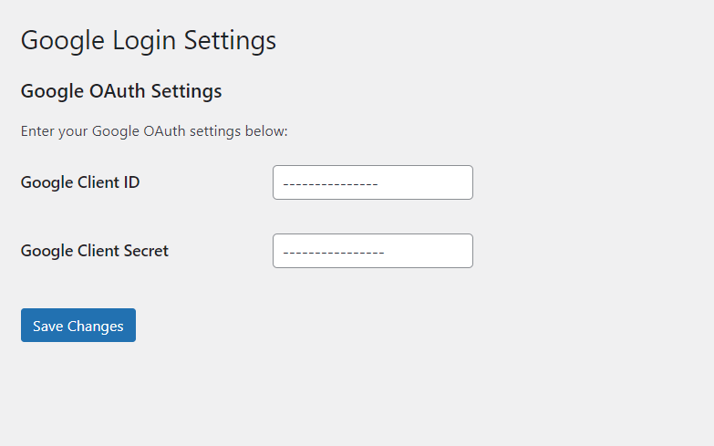
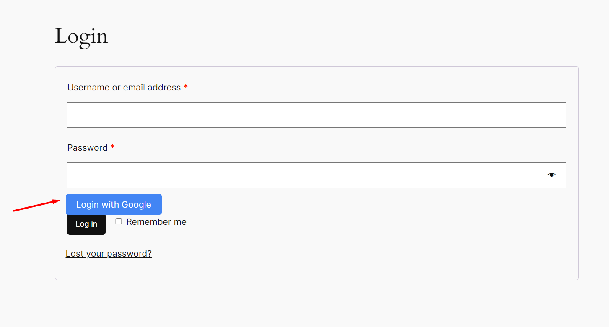

# Social 22

A cool little wp extension for woo-commerce social login system. Currently it only works with google, but features are coming soon. All you need to download project, install required composer packages and then you just need to upload the plugin right into your wordpress plugin. Activate it and you have options to setup the `client_id` and `client_secret` from `settings->Social Login` in the wordpress settings option. 

Now you can get the page like following one, fill out the values you get from the google console and you are ok to login with google 👌👌 

Here is the design of the login page. It's really wak 👎, but don't worry something will come ASAP to make you excited huh!
